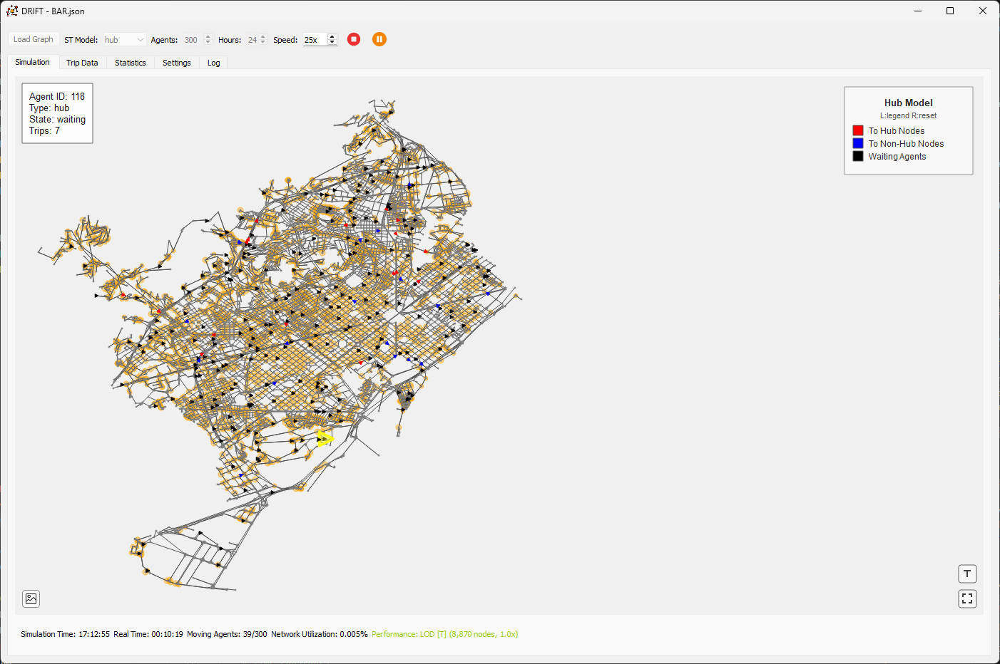
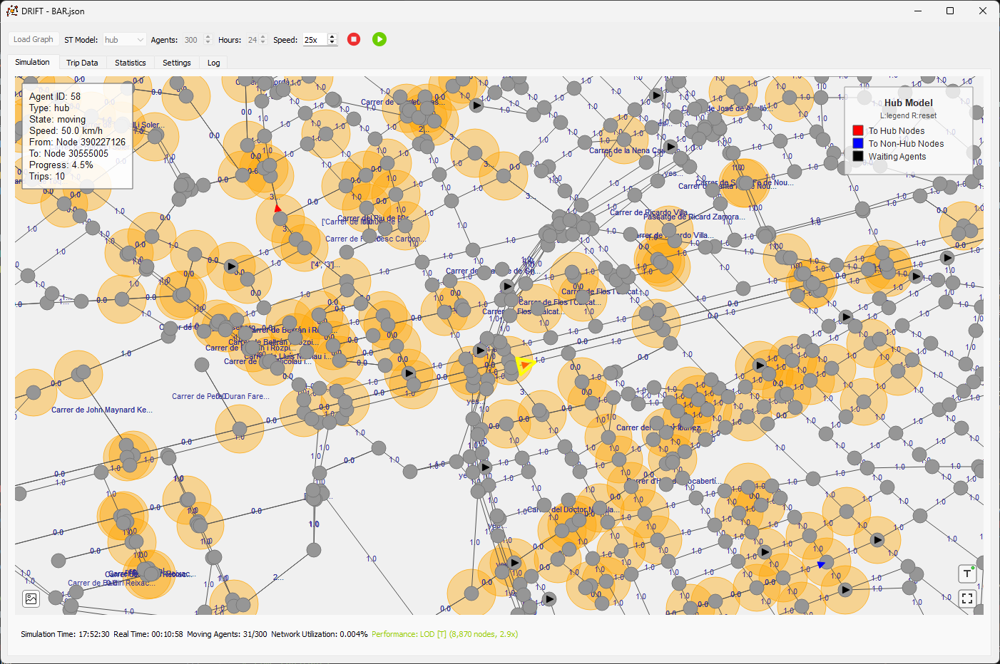
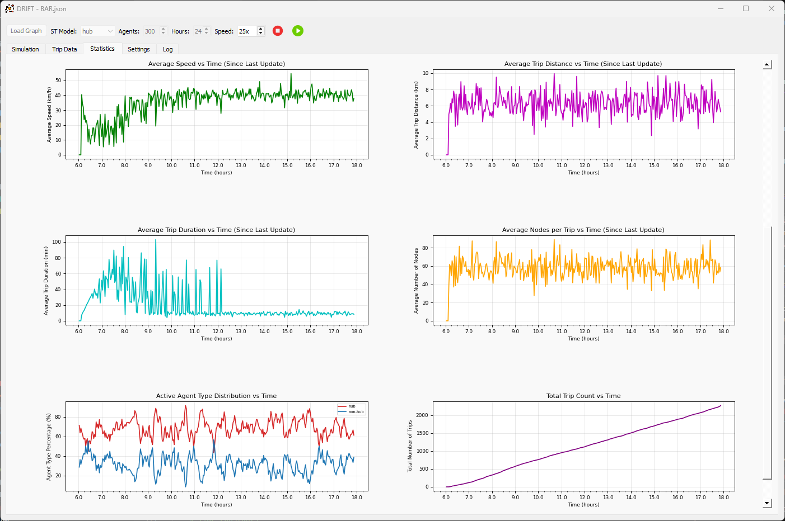

# DRIFT - DRIve Fleet Tool


A mesoscopic traffic simulator designed to balance the fidelity of microscopic modeling with the scalability of macroscopic approaches.



## Overview

DRIFT (DRIve Fleet Tool) represents individual vehicles as discrete agents with unique trajectories and behavioral profiles, while simultaneously capturing aggregate traffic dynamics at the network level. It provides a flexible framework for transportation researchers to study mobility dynamics, congestion patterns, and network optimization.

## Key Features

### 🚗 Agent-Based Mesoscopic Simulation

- Individual vehicle tracking with unique IDs and behavioral profiles
- Link-level flow management for efficient large-scale simulation
- Discrete time steps with continuous-time representation
- Real-time multipliers for accelerated simulation
- Multi-day simulation horizons (up to 48 hours)

### 📊 Multiple Demand Models

- **Random Model**: Uniform distribution of trips across all nodes
- **Activity-Based Model**: Trips based on individual activities and purposes
- **Zone-Based Model**: Geographic zone-based trip distribution
- **Gravity Model**: Distance-decay based trip generation
- **Hub-and-Spoke Model**: Centralized flow patterns through hub nodes

### 🚦 Congestion Modeling

- Bureau of Public Roads (BPR) congestion function
- Dynamic capacity management
- Real-time travel time updates based on traffic volume

### 📈 Real-Time Visualization & Analytics

- Interactive network visualization with pan/zoom controls
- Color-coded agents by type and status
- Live statistics dashboard with 7 time-series plots
- Real-time trip records and performance metrics
- Network topology analysis (diameter, density, clustering)

### 📁 Flexible Data Import/Export

**Input Formats:**

- OpenStreetMap (OSM, PBF)
- GraphML
- JSON
- Matrix Market (MTX)
- CSV edge lists

**Export Capabilities:**

- Trip data (CSV, JSON)
- Statistics and plots (CSV, PNG)
- Network analysis results

## Installation

### Requirements

- Python 3.8+
- PyQt5
- NetworkX
- Matplotlib
- NumPy, SciPy
- OSMnx, GeoPandas
- Seaborn

### Setup

```bash
git clone https://github.com/jbaudru/DRIFT.git
cd DRIFT
pip install -r requirements.txt
python main.py
```

## Usage

1. **Load Network**: Import your network data using the "Load Graph" button
   - Supported formats: OSM, GraphML, JSON, MTX, CSV
   - Sample networks available in `data/` directory

2. **Configure Simulation**:
   - Select source-target (s-t) model
   - Set number of agents (default: 300)
   - Adjust simulation duration and speed

3. **Run Simulation**: Click "Start Simulation" to begin
   - Monitor real-time visualization
   - Track statistics in the analytics dashboard
   - View trip records as they're generated

4. **Export Results**: Save simulation data and plots for analysis

## Project Structure

```text
sim-v2/
├── main.py              # Main application entry point
├── config.py            # Configuration constants
├── lib/                 # Core simulation modules
│   ├── agent.py         # Agent behavior and routing
│   ├── simulation_*.py  # Simulation engine components
│   ├── managers/        # Feature managers (UI, network, etc.)
│   └── tabs/            # UI tab implementations
├── data/                # Sample networks and simulation results
├── fig/                 # Documentation figures
└── assets/              # UI icons and resources
```

## Source-Target Models

### Random Model

All nodes have equal probability for origin/destination selection.

### Activity-Based Model

Agents have individual activity patterns and preferences for trip generation.

### Zone-Based Model

Network is partitioned into geographic zones with configurable inter/intra-zone probabilities.

### Gravity Model

Trip distribution follows gravitational principles: `T_ij = K * (S_i * A_j) / d_ij^β`

### Hub-and-Spoke Model

High-centrality nodes act as hubs, concentrating flows from peripheral nodes.

## Technical Details

- **Congestion Function**: BPR model with configurable α=0.15, β=4.0 parameters
- **Time Resolution**: Discrete time steps with continuous-time representation
- **Architecture**: Modular design with plugin-style s-t model integration
- **Visualization**: Performance-optimized rendering with level-of-detail adjustments

## Sample Networks

The project includes sample networks in `data/`:

- Urban networks (Brussels, Paris, Rome, etc.)
- Regional networks (Belgium, Germany, Asia)
- Test networks for algorithm validation

## Contributing

This project is part of ongoing research in transportation simulation. Contributions, issues, and feature requests are welcome.

## Citation

If you use DRIFT in your research, please cite:

```bibtex
Baudru, J. (2025). DRIFT - A Mesoscopic Traffic Simulator: Technical Report. 
Transportation Research Laboratory.
```

## License

This project is licensed under the MIT License - see the LICENSE file for details.

## Screenshots

| Feature | Screenshot |
|---------|------------|
| Network Visualization |  |
| Detailed View |  |
| Trip Records |  |
| Analytics Dashboard |  |
| Model Comparisons |  |

---

**Author**: Julien Baudru  
**Contact**: [GitHub Profile](https://github.com/jbaudru)